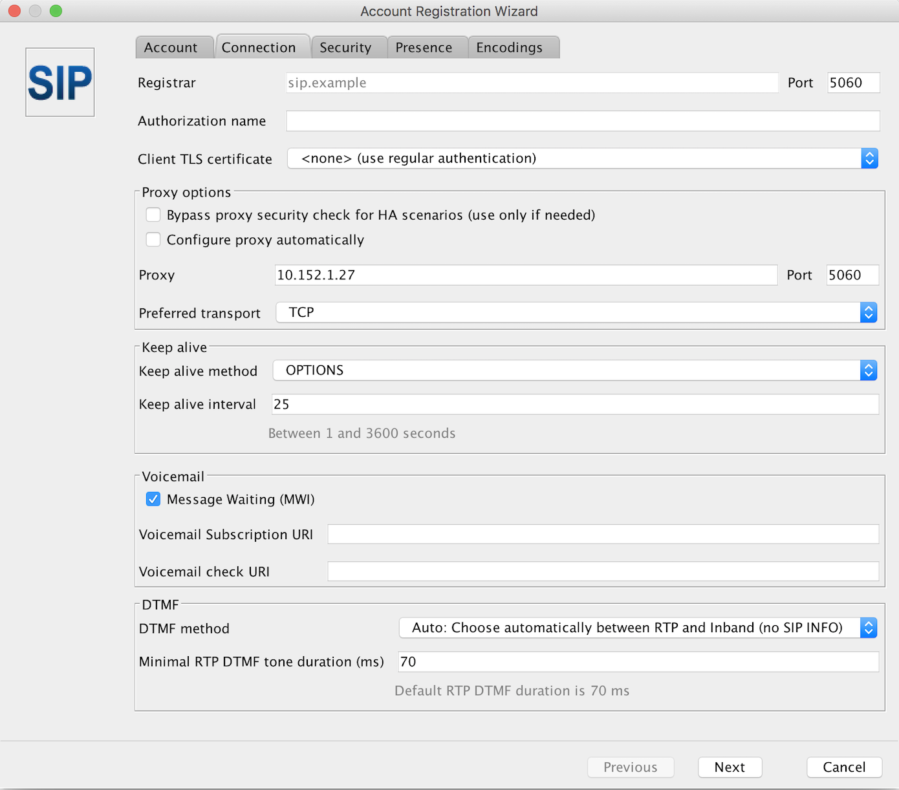
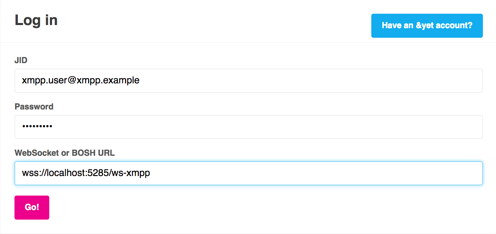

# Jingle/SIP setup proof of concept

This tutorial will show you how to configure MongooseIM, Routr (a SIP server) and client applications to demonstrate how the Jingle/SIP integration works.

## Prerequisites

We are going to use the following open source software:

* MongooseIM - [https://github.com/esl/MongooseIM](https://github.com/esl/MongooseIM)
    * see [How-to-build](How-to-build.md) for details on building.
      It's important to remember to run the configuration script with `with-jingle-sip` flag set:
      `tools/configure with-jingle-sip`.
      Without this, third party dependencies required by the Jingle/SIP translator will not be included in the release.

* Routr (SIP server) - [https://routr.io](https://routr.io)
    * I recommend downloading binaries for your system from [official source](https://routr.io/docs/introduction/installation/#custom).
* Jitsi (XMPP and SIP client application) - [https://desktop.jitsi.org](https://desktop.jitsi.org/)
* Otalk - web based XMPP client - [https://github.com/otalk/otalk-im-client](https://github.com/otalk/otalk-im-client)
    * Follow the instructions on [otalk-im-client#installing](https://github.com/otalk/otalk-im-client#installing) to run it

We will use 2 users `xmpp.user@xmpp.example` and `sip.user@sip.example`.

## Configuring Routr

First the domain `sip.example` needs to be added to domains served by Routr.
To do it, paste the following content to config/domains.yml in the directory where Routr was:

```yaml
- apiVersion: v1beta1
  kind: Domain
  metadata:
    name: SIP domain
  spec:
    context:
      domainUri: sip.example
```

Then the `sip.user@sip.example` needs to be added to `config/agents.yml` like below:

```yaml
- apiVersion: v1beta1
  kind: Agent
  metadata:
    name: SIP User
  spec:
    credentials:
      username: 'sip.user'
      secret: '1234'
    domains: [sip.example]
```

Now Routr can be started with

    ./routr

If all goes well we'll see the following output:

```
[INFO ] Starting Routr
[INFO ] Listening  on 10.152.1.27:5060 [udp]
[INFO ] Listening  on 10.152.1.27:5060 [tcp]
[INFO ] Starting Location service
[INFO ] Starting Registry service
[INFO ] Starting Restful service (port: 4567, apiPath: '/api/v1beta1')
```

It is important to remember the IP address as it'll be used in next point.

### A side note

In Routr's logs you may see messages like

    [WARN ] Unable to register with Gateway -> sip.provider.net. (Verify your network status)

or

    [ERROR] java.lang.RuntimeException: javax.sip.header.TooManyHopsException: has already reached 0!

They can be ignored for the purpose of the tutorial.

## Configuring /etc/hosts

In my case the IP reported by Routr was `10.152.1.27`.
Now we need to use this to update `/etc/hosts` file like below:

    10.152.1.27     sip.example xmpp.example

## Configuring MongooseIM

At this point I assume that MongooseIM was built with `make rel`, that it is running and the current working directory is `_build/prod/rel/mongooseim`.
Similar to Routr, MongooseIM also needs to know which hosts to server.
Please replace the default host defined in `etc/mongooseim.toml`; the line:

```toml
[general]
  hosts = ["localhost"]
```

should be changed to:

```toml
[general]
  hosts = ["xmpp.example", "sip.example"]
```

Now we need to enable `mod_jingle_sip`, please add the following line in modules list (somewhere around line 740 in the same file)

```toml
[modules.mod_jingle_sip]
  proxy_host = "sip.example"
```

More details on MongooseIM configuration you can find in [Configuration](../configuration/configuration-files.md)
and in [Modules configuration](../configuration/Modules.md)

Now we are registering both users in MongooseIM by calling the following commands:

    mongooseimctl account registerUser --username xmpp.user --domain xmpp.example --password test_pass
    mongooseimctl account registerUser --username sip.user --domain sip.example --password test_pass

Yes, we need to have the `sip.user@sip.example` registered in MongooseIM.
This is needed because a Jingle call can be initiated by a regular XMPP client only when the app knows the other user's full JID.
The easiest way to achieve that is to exchange presence information between these 2 users.
This can happen automatically if 2 xmpp users have each other in the roster.

The roster can be set up with the following command:

    mongooseimctl roster setMutualSubscription --userA xmpp.user@xmpp.example --userB sip.user@sip.example --action CONNECT

## Adding users to Jitsi

Now the `sip.user@sip.example` has to be added to Jitsi app.
When the app is opened for the first time it will display a window to configure the user.
Later users can be configured from the `Preferences` page.

### Adding a SIP user

In order to add a user who connects to the SIP server we need to choose the `SIP` protocol from the available `networks` in Jitsi.
In the `SIP id` field we put `sip.user@sip.example` and in the `Password` field we put `1234` as in the `agents.yml` file.
Now we need to switch to `Advanced` options and go to the `Connection` tab.
Here we need to unselect the `Configure proxy automatically` and put the IP of our `Routr` server, port number `5060` and `TCP` as the preferred transport.



### Adding an XMPP user

Now we have to add `sip.user@sip.example` to Jitsi's XMPP network in order to connect this user to MongooseIM over XMPP.
It's very similar to adding a user to Jitsi's SIP network, the only difference is the password,
for the XMPP connection it's `test_pass` as set when registering the user in MongooseIM.
Here we also need to go to the `Advanced` window and the `Connection` tab in order to put the IP address (the same as before) in the `Connect Server` field.
Remember to check the `Override server default options` box.

To connect `sip.user@sip.exmple` to MongooseIM over XMPP is to cheat Jingle a bit, so that the client app for user `sip.xmpp@xmpp.example` can start the Jingle call.
When Jitsi connects this user, it will likely display a warning about the server's certificate.
This is because by default MongooseIM is configured with a freshly generated, self-signed certificate.
We can click `Continue anyway` button in order to proceed.

## Adding user to Otalk

Please follow the instructions on [https://github.com/otalk/otalk-im-client#installing](https://github.com/otalk/otalk-im-client#installing) in order to compile and run the app.
If all goes well, you should see the following message printed in the console:

    demo.stanza.io running at: http://localhost:8000

This means that the app is hosted on `http://localhost:8000`.

> At this point I also recommend opening [wss://localhost:5285/ws-xmpp](wss://localhost:5285/ws-xmpp) in the same browser.
> This endpoint works correctly only for WebSocket connections but most probably you will be prompted about the certificate.
> This is again due to the self-signed certificate.
> We need to add an exception for this certificate in order to successfully connect from Otalk.

Now let's open [http://localhost:8000](http://localhost:8000) where the Otalk app is hosted.
In the `Log in` section put `xmpp.user@xmpp.example` in the `JID` field and `test_pass` in the `Password` filed.
The default WebSocket endpoint in the `WebSocket or BOSH URL` field needs to be changed to:

    wss://localhost:5285/ws-xmpp

Mind the `wss` protocol, Otalk will not connect the user over WebSockets if for example `https` is put in the field.



Now we can hit the `Go!` button and the `xmpp.user@xmpp.example` will connect to MongooseIM.

## Making a call

On the left side we can see that the user already has `sip.user@sip.example` in the roster and there should be a green dot indicating that the user is online.
When we click on the contact, the `Call` button should appear allowing us to initiate the call.

In Jitsi, the following window should pop up:


Behind the scene the following SIP request was send from MongooseIM to Routr.

```
INVITE sip:sip.user@sip.example:5060 SIP/2.0
Via: SIP/2.0/TCP localhost:5600;rport;branch=z9hG4bK1HMB3o-3mbahM
From: xmpp.user <sip:xmpp.user@xmpp.example>;tag=aVEBue
To: sip.user <sip:sip.user@sip.example>
Call-ID: ae602f16-d57d-4452-b83e-36e54bb6d325
CSeq: 159913767 INVITE
Max-Forwards: 70
Content-Length: 2243
Contact: <sip:xmpp.user@localhost:5600;ob;transport=tcp>;+sip.instance="<urn:uuid:f45950f1-70cd-229d-6c2b-8c85903ce14e>"
Content-Type: application/sdp
Supported: outbound,100rel,path
Allow: PRACK,INVITE,ACK,CANCEL,BYE,OPTIONS,INFO,UPDATE,SUBSCRIBE,NOTIFY,REFER,MESSAGE

v=0
o=- 1531401304 1531401304 IN IP4 127.0.0.1
s=nksip
c=IN IP4 127.0.0.1
t=0 0
a=group:BUNDLE sdparta_0 sdparta_1
m=audio 1436 UDP/TLS/RTP/SAVPF 109 9 0 8 101
a=sendrecv
a=mid:sdparta_0
a=setup:actpass
a=fingerprint:sha-256 44:84:41:8F:B7:A3:B7:37:BA:00:26:5E:B1:D6:AB:D0:56:56:CF:53:F2:05:DB:99:DE:D4:1C:63:A4:68:58:EA
a=ice-pwd:49ad0f02b4f5181c9af3c4006575e071
a=ice-ufrag:a3cc96e2
a=rtcp-mux
a=extmap:3 urn:ietf:params:rtp-hdrext:sdes:mid
a=extmap:2/recvonly urn:ietf:params:rtp-hdrext:csrc-audio-level
a=extmap:1 urn:ietf:params:rtp-hdrext:ssrc-audio-level
a=rtpmap:109 opus/48000/2
a=fmtp:109 useinbandfec=1;stereo=1;maxplaybackrate=48000
a=rtpmap:9 G722/8000
a=rtpmap:0 PCMU/8000
a=rtpmap:8 PCMA/8000
a=rtpmap:101 telephone-event/8000
a=fmtp:101 0-15
a=ssrc:1698222108 cname:{ce7fa171-069e-db4f-ba41-cfa4455c1033}
a=ssrc:1698222108 msid:{788b64bb-c4fc-b644-89b0-89f69c78f8b0} {2ba61f91-abca-3e48-84b7-85b57e8fdfb5}
m=video 1031 UDP/TLS/RTP/SAVPF 120 121 126 97
a=sendrecv
a=mid:sdparta_1
a=setup:actpass
a=fingerprint:sha-256 44:84:41:8F:B7:A3:B7:37:BA:00:26:5E:B1:D6:AB:D0:56:56:CF:53:F2:05:DB:99:DE:D4:1C:63:A4:68:58:EA
a=ice-pwd:49ad0f02b4f5181c9af3c4006575e071
a=ice-ufrag:a3cc96e2
a=rtcp-mux
a=extmap:5 urn:ietf:params:rtp-hdrext:toffset
a=extmap:4 http://www.webrtc.org/experiments/rtp-hdrext/abs-send-time
a=extmap:3 urn:ietf:params:rtp-hdrext:sdes:mid
a=rtpmap:120 VP8/90000
a=fmtp:120 max-fr=60;max-fs=12288
a=rtcp-fb:120 goog-remb
a=rtcp-fb:120 ccm fir
a=rtcp-fb:120 nack pli
a=rtcp-fb:120 nack
a=rtpmap:121 VP9/90000
a=fmtp:121 max-fr=60;max-fs=12288
a=rtcp-fb:121 goog-remb
a=rtcp-fb:121 ccm fir
a=rtcp-fb:121 nack pli
a=rtcp-fb:121 nack
a=rtpmap:126 H264/90000
a=fmtp:126 packetization-mode=1;level-asymmetry-allowed=1;profile-level-id=42e01f
a=rtcp-fb:126 goog-remb
a=rtcp-fb:126 ccm fir
a=rtcp-fb:126 nack pli
a=rtcp-fb:126 nack
a=rtpmap:97 H264/90000
a=fmtp:97 level-asymmetry-allowed=1;profile-level-id=42e01f
a=rtcp-fb:97 goog-remb
a=rtcp-fb:97 ccm fir
a=rtcp-fb:97 nack pli
a=rtcp-fb:97 nack
a=ssrc:823938224 cname:{ce7fa171-069e-db4f-ba41-cfa4455c1033}
a=ssrc:823938224 msid:{788b64bb-c4fc-b644-89b0-89f69c78f8b0} {a7f87c8d-6002-fd4c-badb-13383c759e48}
```

And Routr sent the `Ringing` response code to MongooseIM as soon as the Jitsi app displayed the incoming call window:

```
SIP/2.0 180 Ringing
CSeq: 159913767 INVITE
Call-ID: ae602f16-d57d-4452-b83e-36e54bb6d325
From: "xmpp.user" <sip:xmpp.user@xmpp.example>;tag=aVEBue
To: "sip.user" <sip:sip.user@sip.example>;tag=9b4c72a3
Via: SIP/2.0/TCP localhost:5600;rport=54071;branch=z9hG4bK1HMB3o-3mbahM;received=10.152.1.27
Contact: "sip.user" <sip:sip.user@10.152.1.27:53697;transport=tcp;registering_acc=sip_example>
User-Agent: Jitsi2.10.5550Mac OS X
Content-Length: 0
```

## Summary

The example above showcases how you can use Jingle/SIP switch with the available open source software.
Sonetel, who are this feature's sponsor, operate on a slightly different use case and utilize more of the functionality with their proprietary software.
Current implementation makes following assumptions:

* The peer-to-peer stream is always encrypted.
  This means that MongooseIM expects element `<fingerprint>` as described in [XEP-0320: Use of DTLS-SRTP in Jingle Sessions](https://xmpp.org/extensions/xep-0320.html) to be in the content description.
  Not every open source XMPP client supporting Jingle supports this encryption.
* MongooseIM expects that the `200 OK` response contains at least one ICE candidate to set the peer-to-peer connection up.

This makes the current implementation a bit limited, but on the other hand the basic integration between XMPP and SIP world is already there.
Based on the current state it can be improved and extended if needed.
